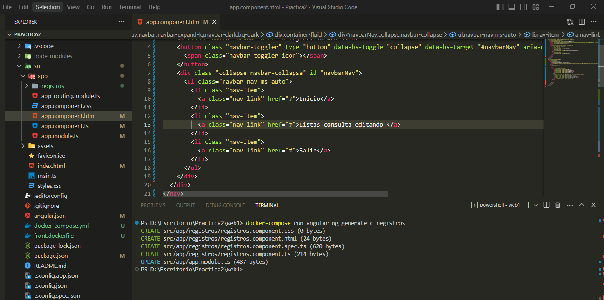
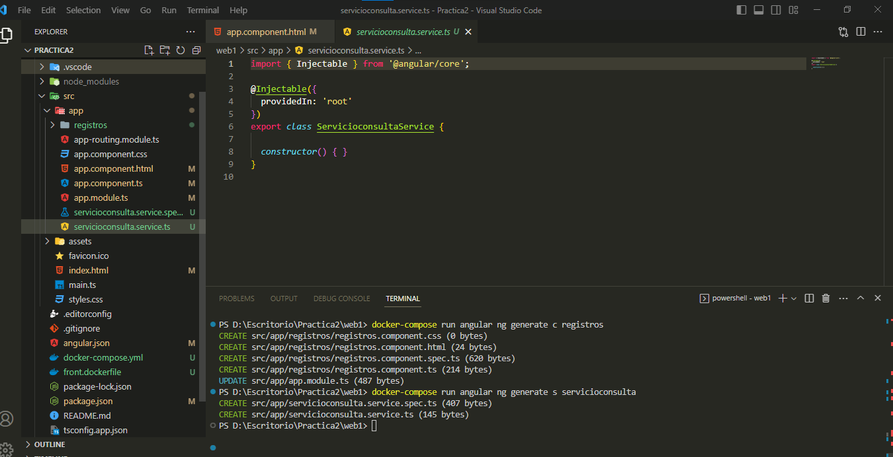
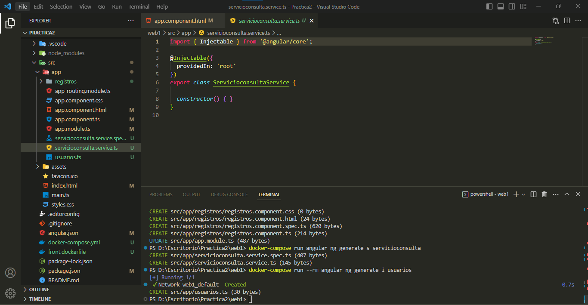
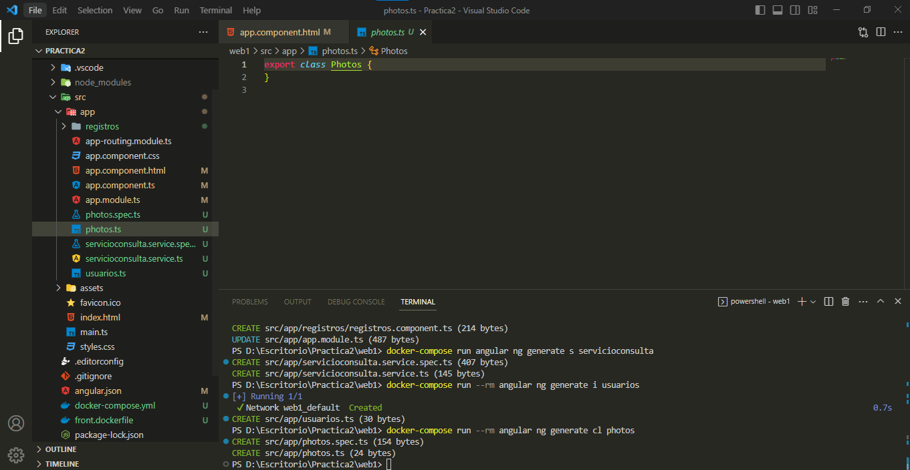
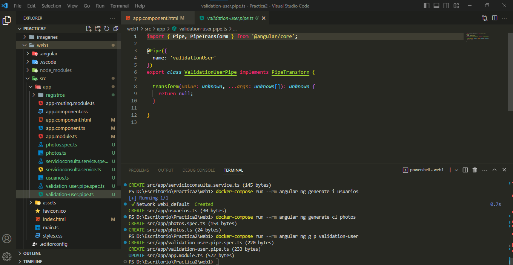
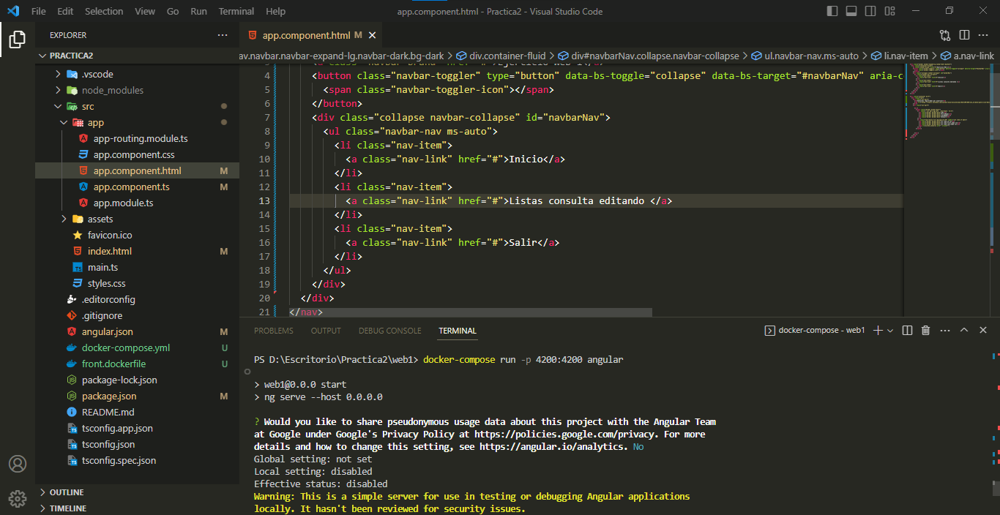
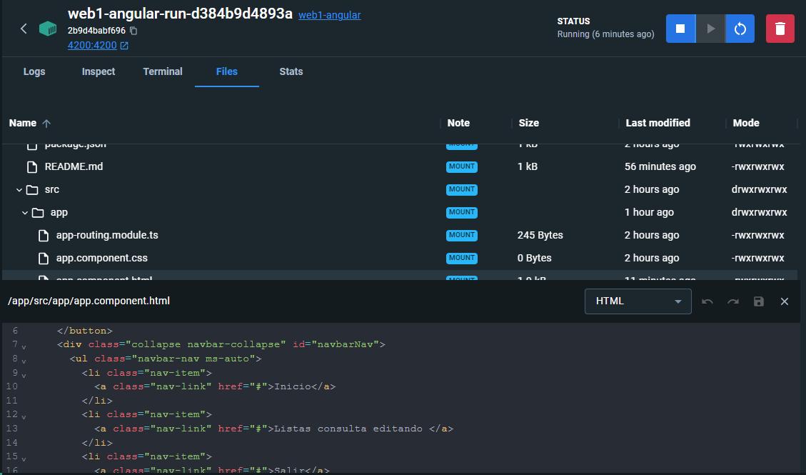
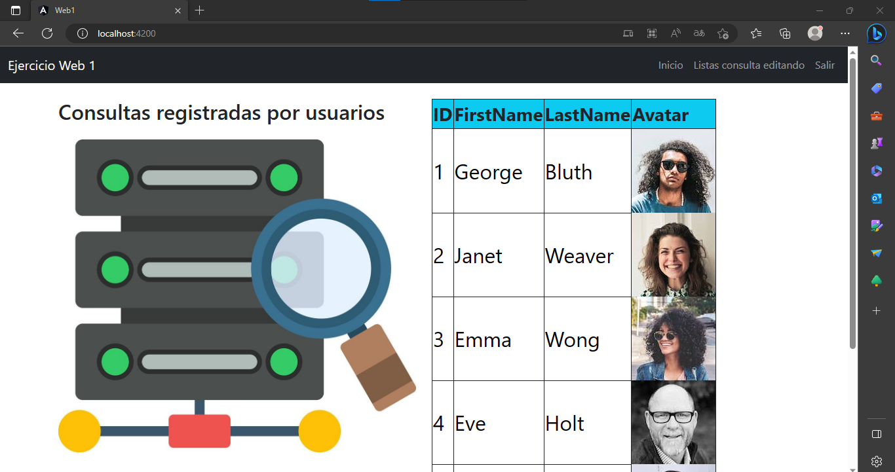

# EVIDENCIA PRÁCTICA 2


# 5 Funcionalidades de las herramientas CLI 

## Se puede usar el siguiente comando dentro del container para sus funcionalidad
```
docker-compose run angular
```












## Evidencia de los cambios , se edita desde el editor y se ve los cambios en el container





## Cambios en el frontend




