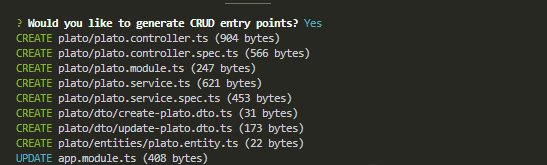
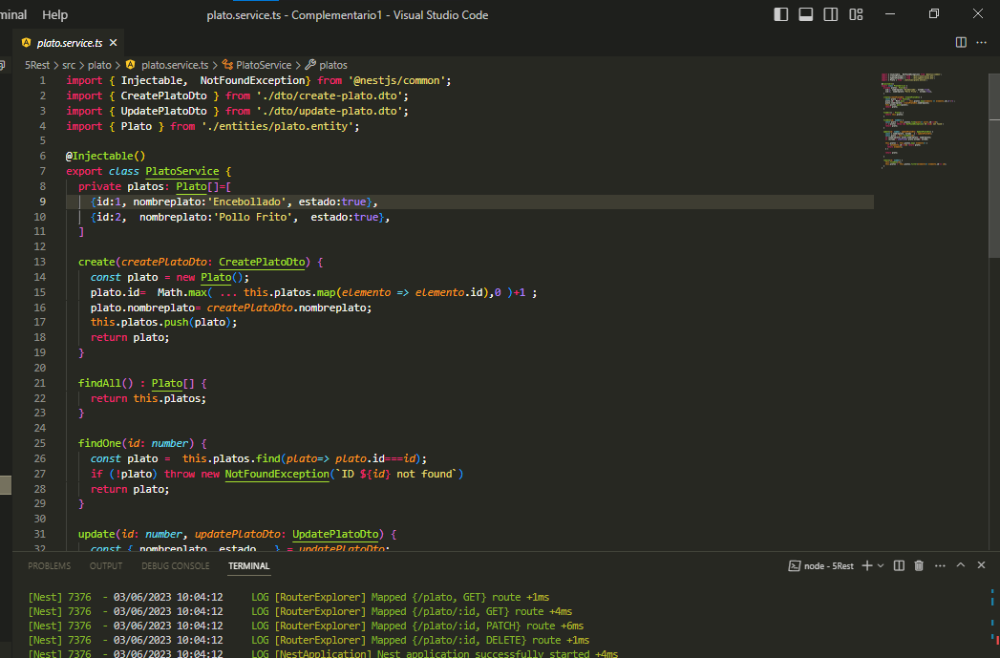
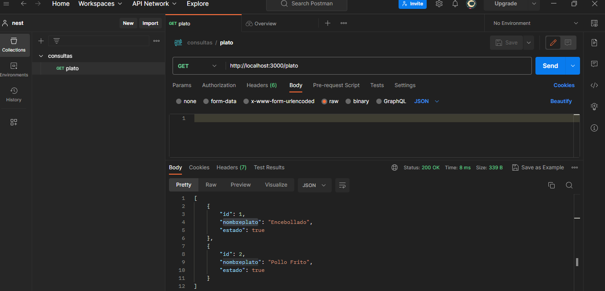
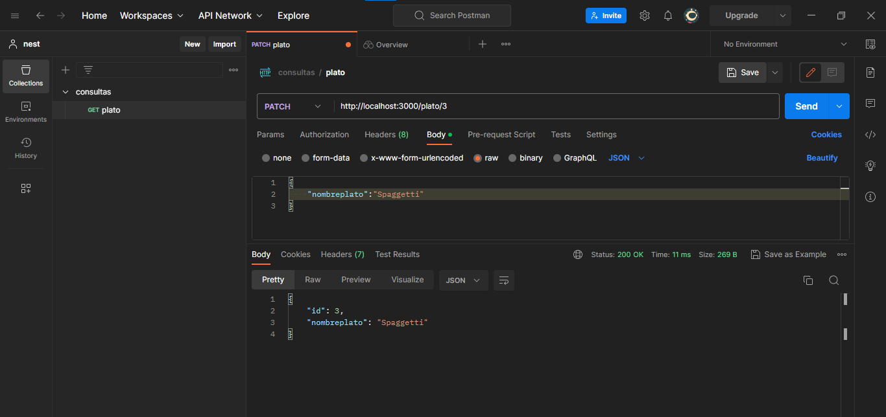
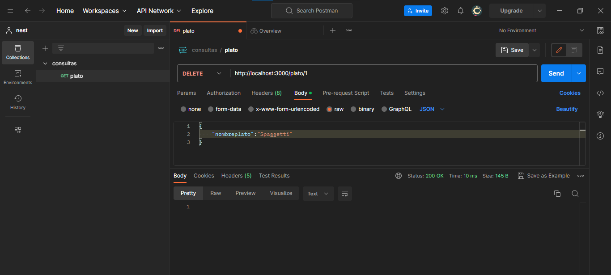

# ENUNCIADO: 1. Utilizando NEST Desarrollar la ruta de un servicio REST que aplique arrays como persistencia basada en una de sus entidades maestras asignadas al inicio del parcial.

# Recurso de mi entidad plato

# Desde  POSTMAN 

## GET

## POST

## PATCH

## DELETE

