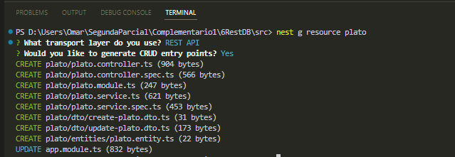
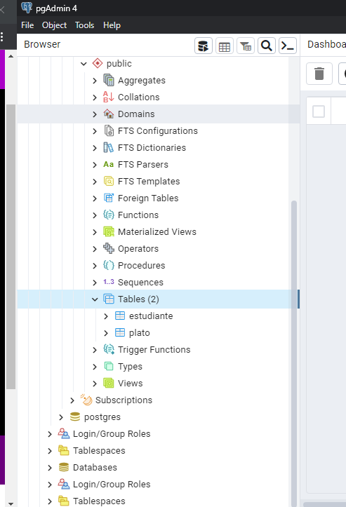
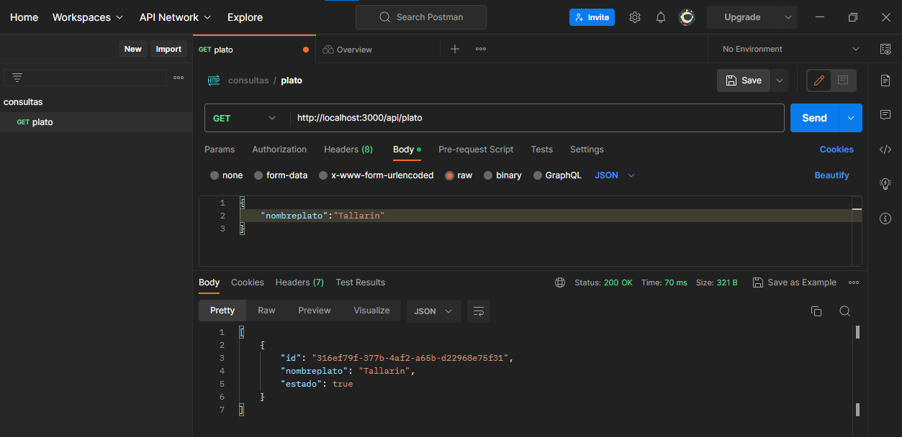
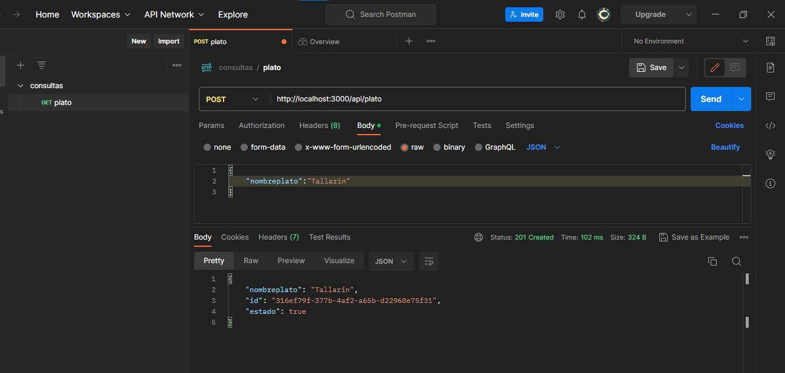
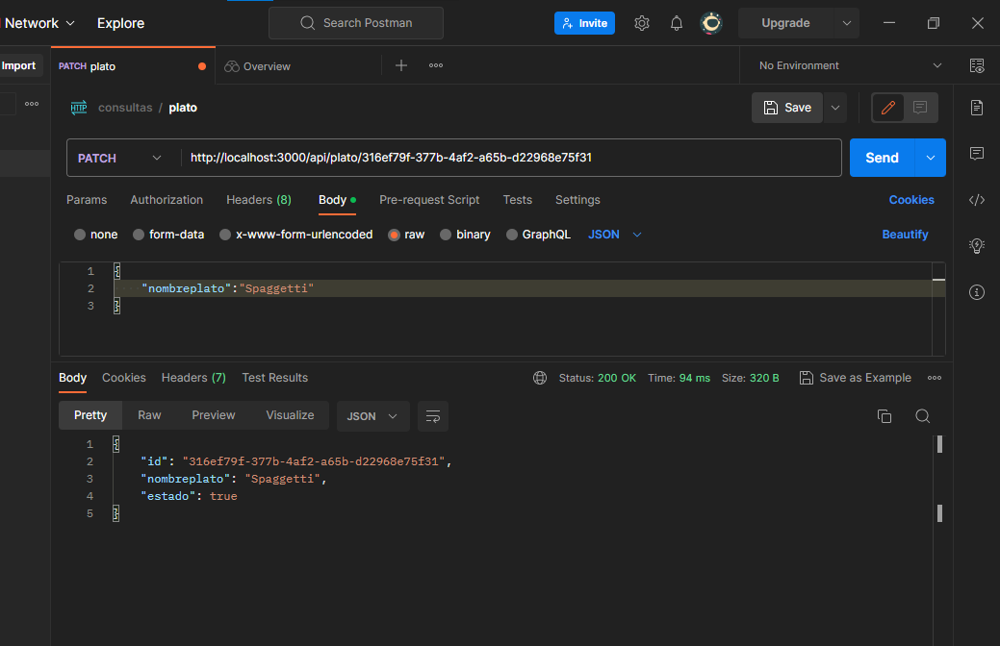
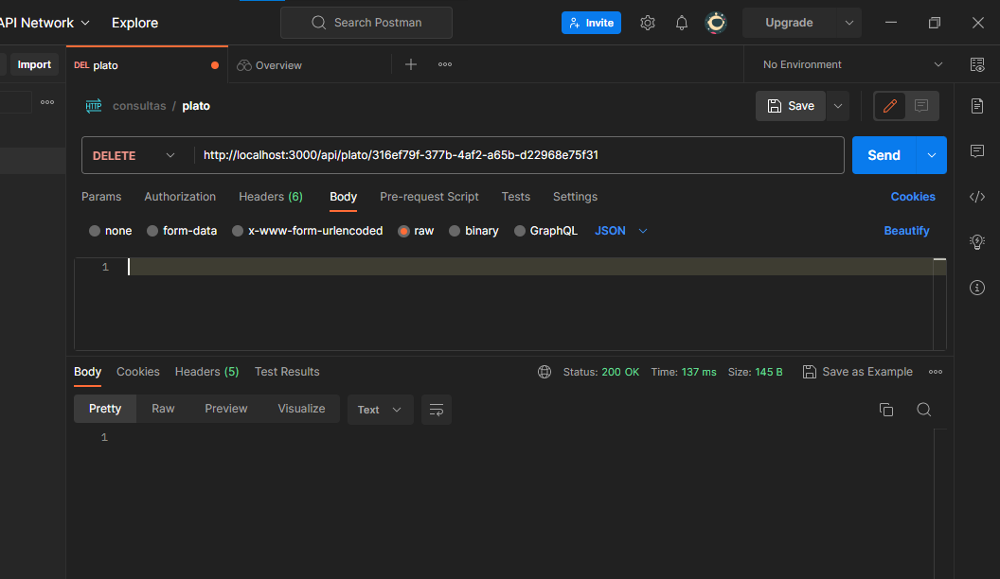
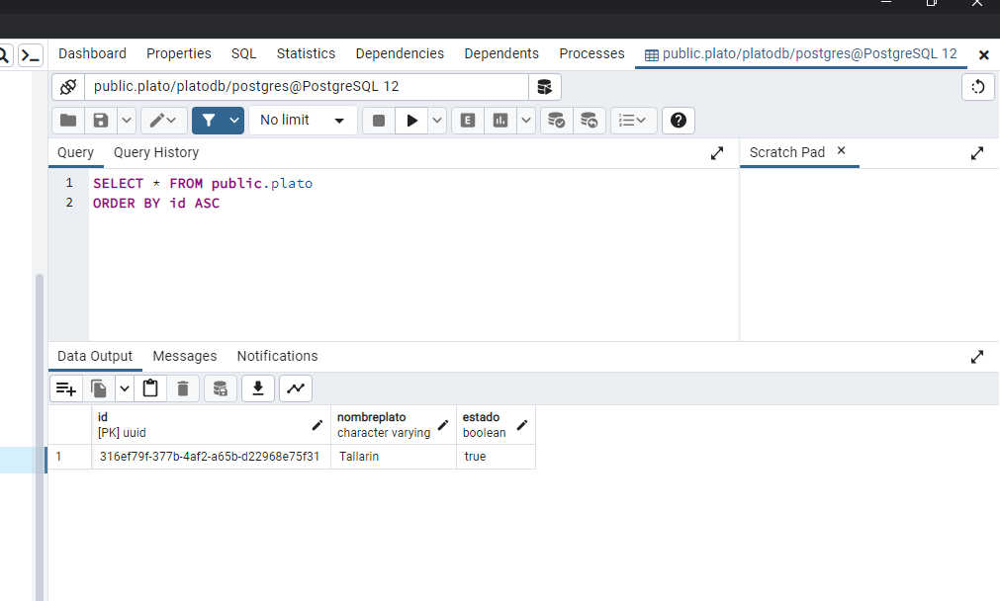

# ENUNCIADO: 2. Utilizando NEST Desarrollar la ruta de un servicio REST que aplique una base de datos relacional o no relacional como persistencia basada en una de sus entidades maestras asignadas al inicio del parcial.


## Genere el recursos

```
nest g resource plato
```

## Ejecute el proyecto

```
npm start
```


# Recurso de mi entidad plato




# Tabla Plato desde base de datos 



# Desde  POSTMAN 

## GET



## POST



## PATCH



## DELETE



#  Evidencia de base de datos





